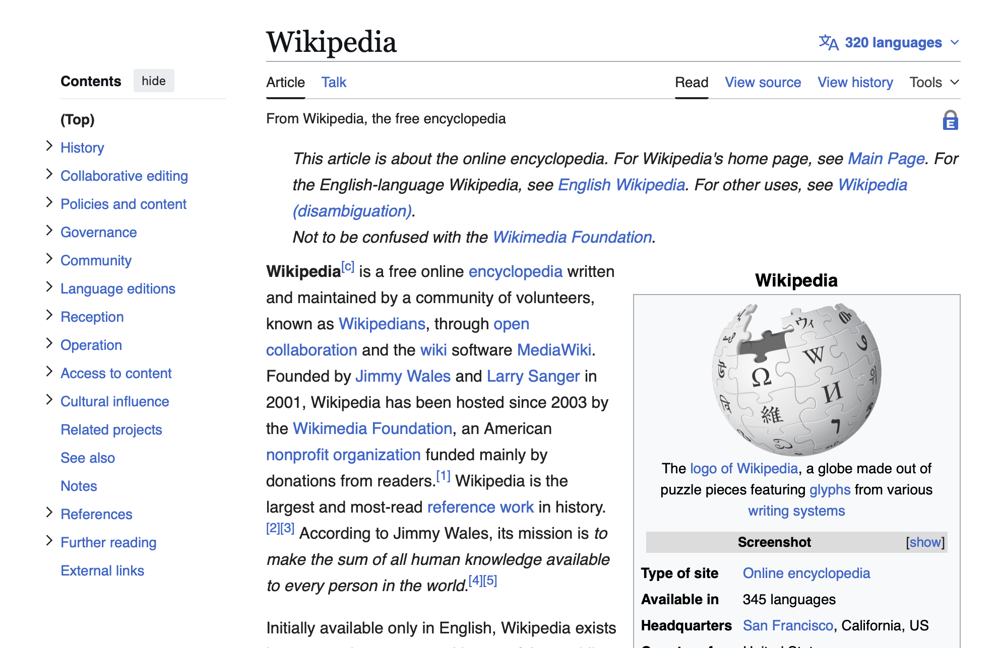
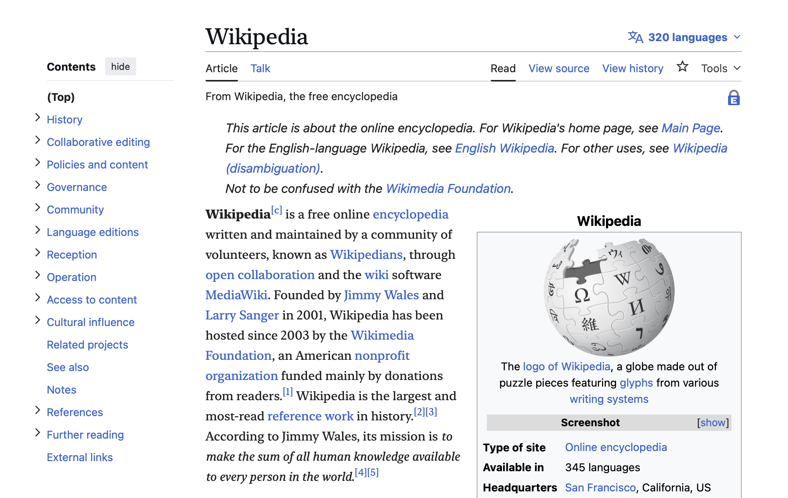
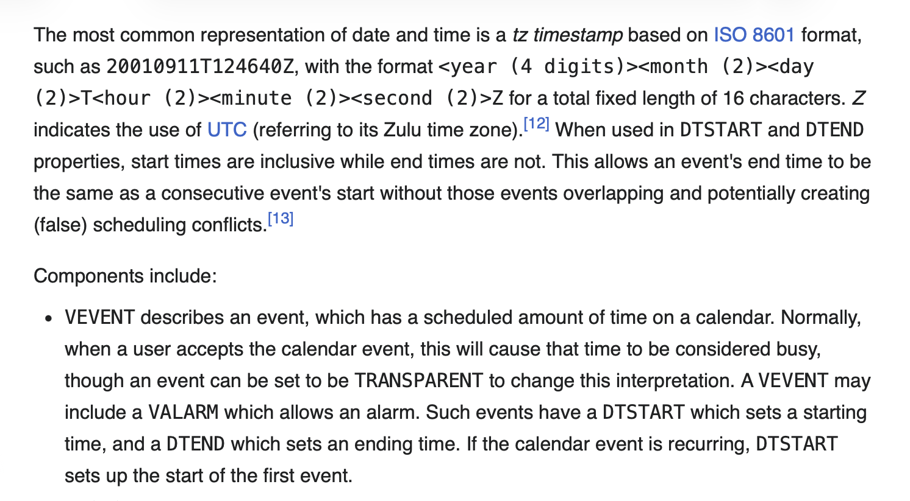
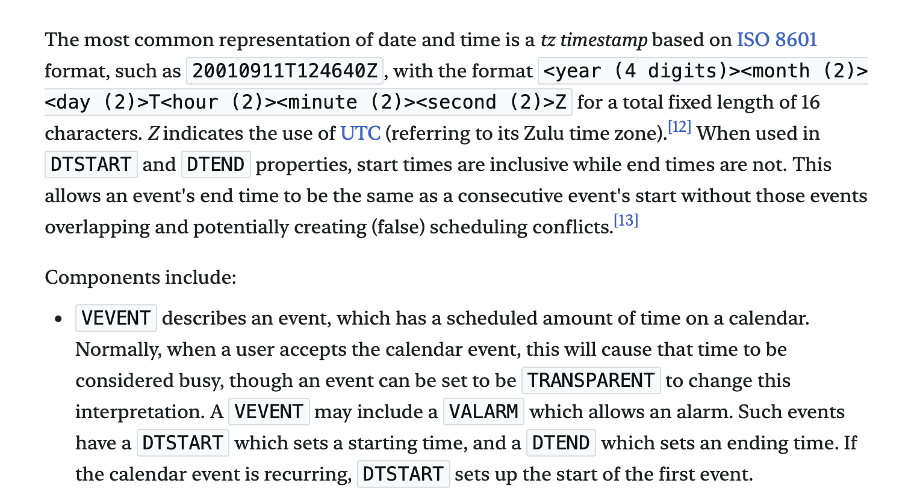

# Refined Vector 2022

Refinements for Wikipedia’s [Vector 2022 skin](https://en.wikipedia.org/wiki/Wikipedia:Vector_2022)

## Usage

1. Log in to Wikipedia
1. Make sure the **Vector (2022)** skin is active in Preferences → Appearance
1. Copy the [CSS](#css) into your [Special:MyPage/common.css](https://en.wikipedia.org/wiki/Special:MyPage/common.css)
   - For more information, see [Wikipedia’s Help:User style page](https://en.wikipedia.org/wiki/Help:User_style)

## Features

### Fonts

- More modern system font stacks for sans-serif and monospace fonts
- System serif font for article body
- Improved visual differentiation of inline monospaced text

#### Screenshots

| Before | After |
|---|---|
| <picture><source media="(prefers-color-scheme: dark)" srcset="screenshots/fonts-unrefined-dark.png"><source media="(prefers-color-scheme: light)" srcset="screenshots/fonts-unrefined-light.png"></picture> | <picture><source media="(prefers-color-scheme: dark)" srcset="screenshots/fonts-refined-dark.png"><source media="(prefers-color-scheme: light)" srcset="screenshots/fonts-refined-light.png"></picture> |
| <picture><source media="(prefers-color-scheme: dark)" srcset="screenshots/monospace-unrefined-dark.png"><source media="(prefers-color-scheme: light)" srcset="screenshots/monospace-unrefined-light.png"></picture> | <picture><source media="(prefers-color-scheme: dark)" srcset="screenshots/monospace-refined-dark.png"><source media="(prefers-color-scheme: light)" srcset="screenshots/monospace-refined-light.png"></picture> |

## CSS

<!-- docs CODE src="./refined-vector-2022.css" -->
```css
:root {
	/* tailwind 4.2 font stacks - https://tailwindcss.com/docs/font-family */
	--font-sans:
		ui-sans-serif, system-ui, sans-serif, 'Apple Color Emoji', 'Segoe UI Emoji',
		'Segoe UI Symbol', 'Noto Color Emoji';
	--font-serif: ui-serif, georgia, cambria, 'Times New Roman', times, serif;
	--font-mono:
		ui-monospace, sfmono-regular, menlo, monaco, consolas, 'Liberation Mono',
		'Courier New', monospace;
}

/* copies of original selectors */

/* base font: sans-serif */
html,
body {
	font-family: var(--font-sans);
}

/* heading font: serif */
.mw-body h1,
.mw-body .mw-heading1,
.mw-body-content h1,
.mw-body-content .mw-heading1,
.mw-body-content h2,
.mw-body-content .mw-heading2,
.pre-content h1,
.content .mw-heading1,
.content h1,
.content .mw-heading2,
.content h2 {
	font-family: var(--font-serif);
}

/* body font: serif */
.mw-body p {
	font-family: var(--font-serif);
}

/* monospace elements font: mono */
pre,
code,
tt,
kbd,
samp,
.mw-code,
.content kbd,
.content samp,
.content code,
.content pre {
	font-family: var(--font-mono);
}

/* inline monospaced text: copy styles from other monospaced elements */
.mw-parser-output .monospaced {
	/* copied from `code` selector */
	border-radius: 2px;
	padding: 1px 4px;

	/* copied from `pre, code, .mw-code` selector */
	background-color: var(--background-color-neutral-subtle, #f8f9fa);
	color: var(--color-emphasized, #101418);
	border: 1px solid var(--border-color-muted, #dadde3);
}

/* /copies of original selectors */

/* new selectors */

/* body list items font: serif */
.mw-body-content li {
	font-family: var(--font-serif);
}

/* /new selectors */
```
<!-- /docs -->
